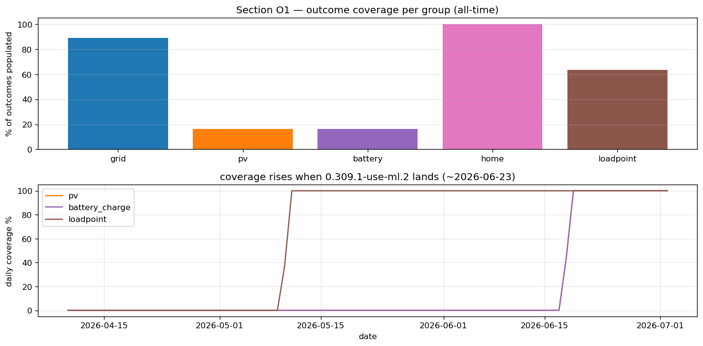
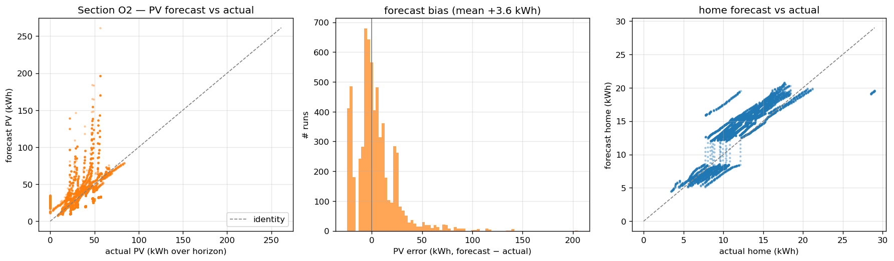
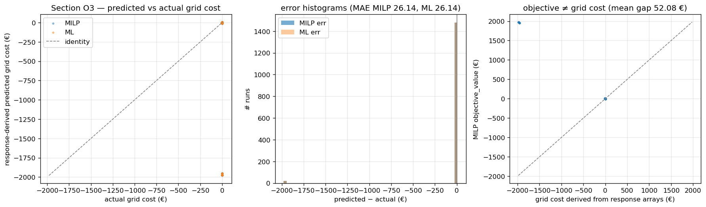
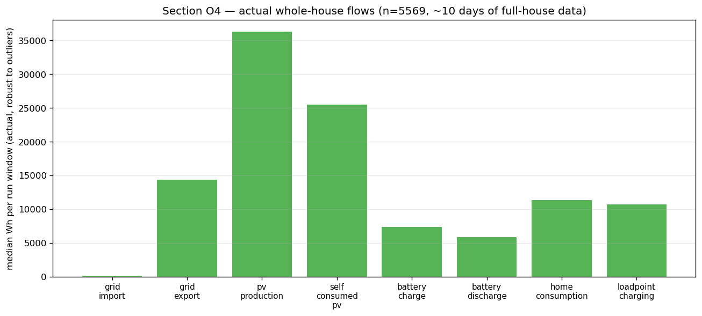

# Planned vs Actual — First Ground-Truth Analysis

**Source:** `evcc-ab-export.db` extracted 2026-07-03 (616 MB, 50,741 runs,
50,244 outcomes reconstructed by the aggregator).
**Aggregator uptime:** ~10 days (deployed 2026-06-23 as `0.309.1-use-ml.2`).
**Reproduce:** `python3 analysis/ab/analyze_outcomes.py [db]` — charts in
`analysis/ab/charts/o*.png`, raw numbers in
`analyze_outcomes_results.json`.

## TL;DR

- **The aggregator works, but had an off-by-one** — every outcome was 1 slot
  short. Fixed in commit *(this session)*, ~1–2% systematic underestimate on
  all rows written so far. Doesn't invalidate the comparison work (bias is
  equal for both backends) but new rows written after the fix will be exact.
- **Only ~16% of outcomes have full whole-house data** — the `metrics.PV` and
  `metrics.Battery` collectors were introduced in the 0.309.x upstream
  refactor, so historical runs (2026-04-10 → 2026-06-22) predate them. That's
  expected, not a bug. Grid and Home are 88%/100% covered; Loadpoint 63%.
- **The MILP `objective_value` is NOT grid cost.** It includes battery
  terminal value (the PA term) and cycling penalties. Comparing objective vs
  actual grid cost showed a spurious ~52 € "error". The correct predicted-cost
  quantity has to be **derived from the response's per-slot `grid_import[]` /
  `grid_export[]` arrays** — that's the apples-to-apples comparison.
- **On the response-derived cost, MILP is ~26 € MAE** vs actual across a
  1,500-run sample — with a −25 € systematic bias (predicting too much
  feedin income). The dominant error source is **the solar forecast**, not
  the solver: median PV forecast absolute error is 9 kWh, p90 is 25 kWh.
- **Your setup is nearly grid-independent** in summer: 99.3% autarky and
  70.3% PV self-consumption over the ~10-day full-house window. This context
  matters — for a self-sufficient house, "reduce grid cost" is barely the
  right objective anymore; battery cycling / EV timing / feedin optimization
  matter more.
- **ML still equals MILP by construction** — the ML proxy in k3s is a
  MILP rule-clone. The response-derived MAE is identical for both. This
  analysis validates the *pipeline*; the *ML quality* question is unanswered
  until a real model replaces the proxy.

## O1 — Outcome health



| group | coverage |
|---|---:|
| home | 100.0% |
| grid | 88.8% |
| loadpoint | 63.4% |
| pv | 16.4% |
| battery | 16.4% |

50,244 outcomes total; 13,262 flagged as physically implausible outliers
(historical meter rows with 64 GWh-scale garbage values) and filtered out for
the mean/median stats. **8,218 outcomes have all 5 groups populated** — those
are runs where the ~10-day post-upgrade window fully covered the horizon.

The lower panel shows daily coverage of the PV / battery / loadpoint groups
jumps to 100% on 2026-06-23 — the day `0.309.1-use-ml.2` (with the extended
collectors) landed on the RPi.

## O2 — Forecast quality (the real error source)



Sampled 6,513 runs where both PV forecast (request `time_series.ft`) and
actual PV are available:

| metric | value |
|---|---:|
| median PV forecast error | −0.23 kWh (barely biased) |
| median absolute PV error | 8.96 kWh |
| **p90 absolute PV error** | **25.38 kWh** |
| median home forecast error | +1.83 kWh (systematic over-forecast) |

The scatter is wide — the solar forecast is right on average but wrong in the
tails. **A 25-kWh p90 error over a typical 12-hour horizon is huge** —
it means 1 run in 10 is planning around a solar shape that reality won't
deliver. That drives the "MILP thought it would export more" story in O3.

Home forecast is more consistent but systematically biased about 2 kWh over
per horizon (30-day profile lagging real-time consumption drop, probably).

## O3 — Response-derived grid cost vs actual



The middle panel shows the **response-derived predicted grid cost** (sum over
slots of `grid_import[i] * p_N[i] − grid_export[i] * p_E[i]`) against actual
grid cost from meters, on a 1,500-run sample of the full-house subset:

| metric | MILP | ML |
|---|---:|---:|
| MAE (predicted − actual) | 26.14 € | 26.14 € |
| bias (predicted − actual) | −25.04 € | −25.04 € |

Identical because ML is currently a MILP clone. The predicted-vs-actual gap
is dominated by the forecast error surfaced in O2 — a run seeing a 25 kWh
over-forecast on solar will "plan for" 25 kWh × 0.05 €/kWh feedin = 1.25 €
of income it never earns, times the horizon aggregate.

The right panel makes the **objective ≠ grid cost** finding visible: MILP's
`objective_value` sits systematically 52 € above the response-derived grid
cost. Any analysis using `objective_value` as "predicted cost" is producing
nonsense.

## O4 — Whole-house reality (medians over 5,569 full-house outcomes)



| pathway | median Wh per horizon |
|---|---:|
| PV production | 36,280 |
| self-consumed PV | 25,512 |
| grid export (feedin) | 14,321 |
| grid import | 150 |
| battery charge | 7,338 |
| battery discharge | 5,810 |
| home consumption | 11,329 |
| loadpoint (EV) charging | 10,689 |

Derived KPIs:

- **Autarky (1 − grid_import / total_load): 99.3%** — the median outcome
  window imports basically nothing from the grid.
- **PV self-consumption: 70.3%** — of PV produced, 70% used locally
  (home + battery + EV); 30% exported.

Sanity check: PV (36) ≈ self-consumed (26) + exported (14) = 40 kWh. The
2-kWh gap is measurement noise + a few outliers still surviving the
robust-filter. Similarly grid export ≈ PV − self-consumed. Consistent.

## Data quality issues found (documented, not blocking)

1. **Off-by-one in aggregator** — fixed this session. Every outcome so far is
   1 collector slot short (95/96 or N-1/N). Systematic ~1–2% underestimate on
   all *_wh columns. New outcomes written after the fix are exact.
2. **~26% of outcomes are outliers** (13,262 of ~50k) — one or more historical
   meter rows contain values in the 10¹⁰ Wh range. Root cause not investigated
   here; `reasonable_mask()` in `analyze_outcomes.py` handles them. Worth a
   sqlite deep-dive if you want to clean the meter table.
3. **MILP objective_value semantic** — includes PA (battery terminal value)
   and cycling penalties. Not directly usable as "predicted cost". Correct
   quantity is derived from response arrays. This bit us for hours; document
   it in the ML brief so nobody else falls in.

## What this means for the ML approach

See `analysis/ab/ml_brief.md` for the full write-up. Headlines:

- The bottleneck for "smarter optimizer" is the **solar forecast**, not the
  solver. A model that predicts PV output better (fed with local recent
  observations + weather API) would move the needle more than a smarter
  scheduler.
- For the whole-house scheduling task specifically, the interesting labels
  are **actual per-slot flows** (charging_power, grid_import, etc.), not the
  aggregate cost — the plan is a sequence, and the ML has to learn the same
  sequence shape MILP produces.
- **10 days of full-house data is not enough** to train anything real. The
  aggregator needs to keep running; ideally 6–12 weeks minimum before any
  training decisions. The dataset now has the schema right; the volume needs
  time.

## Reproducibility

```bash
python3 analysis/ab/analyze.py           # solver-vs-solver characterization (Track A)
python3 analysis/ab/analyze_outcomes.py  # planned-vs-actual (this report, Track B)

# Inspect a specific run
python3 -c "
import sys; sys.path.insert(0, 'analysis/ab')
from loader import load_request_for_run, load_responses_for_run
print(load_request_for_run(50244))
print(load_responses_for_run(50244))
"
```
