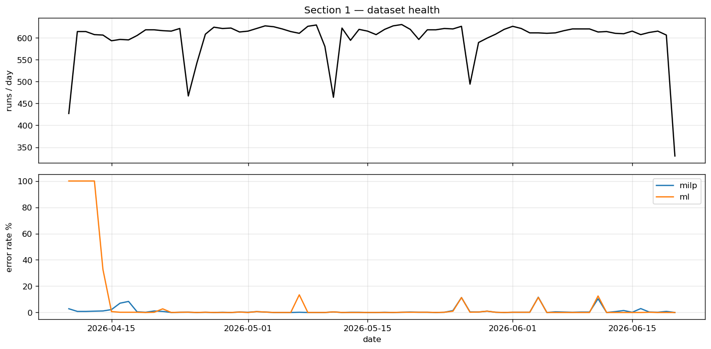
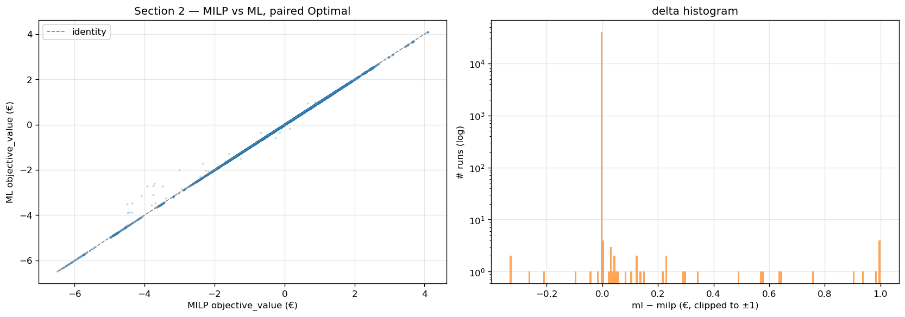
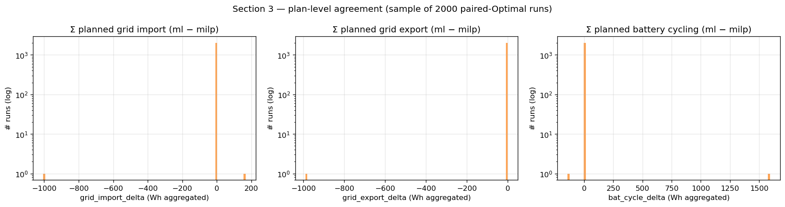
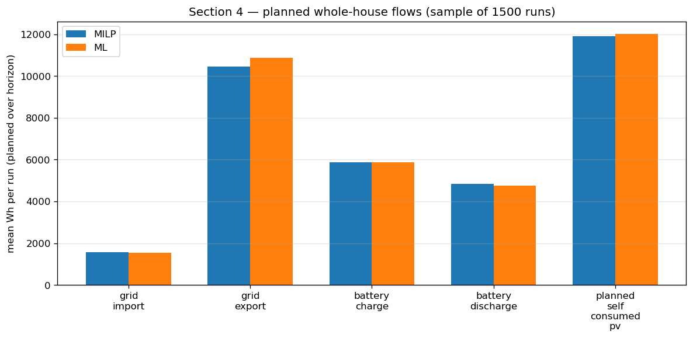
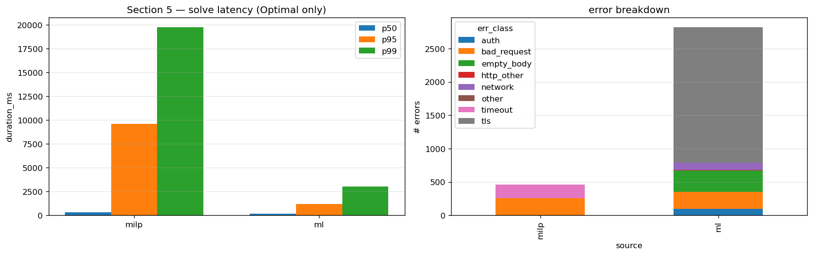
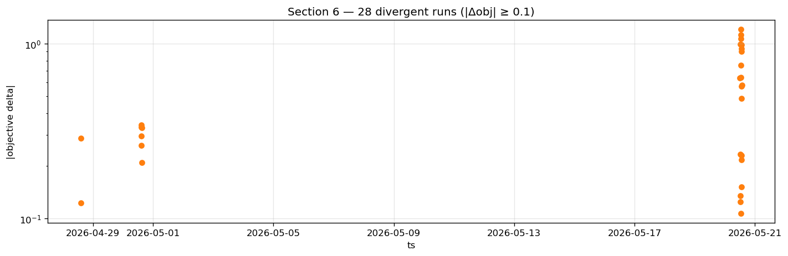
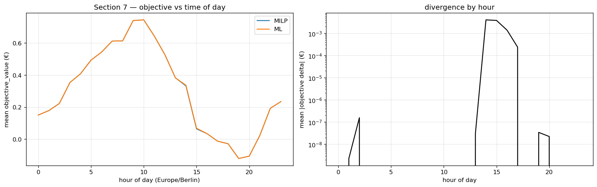
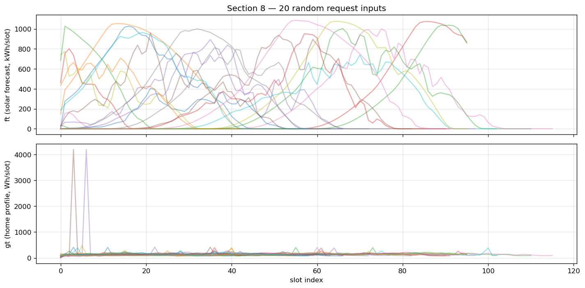

# A/B Optimizer Shadow Evaluation — 71-day Analysis

**Source:** `evcc-ab-export.db` extracted from
`/addon_configs/97d03a59_evcc_feature/evcc.db` on 2026-06-20.
**Period:** 2026-04-10 → 2026-06-20 (72 days, 43,230 runs, 614 runs/day median)
**Reproduce:** `python3 analysis/ab/analyze.py [path-to-export.db]` —
all charts under `analysis/ab/charts/`, raw numbers in `analyze_results.json`.

## TL;DR

- The harness is healthy. 72 days of uninterrupted shadow-mode operation,
  one paired run every ~2 min when both backends were reachable.
- **MILP and ML produce essentially the same plans.** Of 40,231 paired-Optimal
  runs, 99.88% agree on objective_value to within 0.0001 €; only 28 (0.07%)
  diverge by ≥ 0.10 €, and those cluster in three short episodes.
- ML is **2.3× faster at p50 (146 ms vs 333 ms)** and **6.5× faster at p99
  (3.0 s vs 19.8 s)** — but the ML side is currently a rule-clone proxy of
  MILP, so "ML wins on speed" is not a quality claim, just confirmation that a
  lighter solver round-trip is reachable.
- ML errors are 6× MILP's (6.5% vs 1.1%), and **72% of ML errors (2,032 / 2,823)
  are TLS verification failures from the first weeks** before
  `InsecureSkipVerify` was added on the client.
- `ab_actual_outcomes` is empty — there is no ground truth yet to score either
  backend against reality. **This is the bottleneck for any real "which solver
  is smarter" question.** Track B (the outcome aggregator) is the next PR.

## 1 — Dataset health



Steady volume around 600 runs/day after the harness reached steady state in
mid-April. Two visible bumps in the ML error rate correspond to the early TLS
issue and a k3s outage window — see Section 5.

## 2 — Solver agreement on the objective



40,231 paired-Optimal runs. The scatter rides the identity line; the
histogram shows the deltas pile up at zero with a sparse long tail. The
remaining mass lives in Section 6.

| metric | value |
|---|---|
| agree within 1e-4 € | 40,183 (99.88%) |
| agree within 1e-2 € | 40,190 (99.90%) |
| diverge ≥ 0.10 € | 28 (0.07%) |
| mean signed delta (ml − milp) | +0.0003 € |
| mean absolute delta | 0.0004 € |

## 3 — Plan-level agreement (slot-by-slot)



Sampled 2,000 paired-Optimal runs and compared the per-slot `grid_import`,
`grid_export`, and per-battery `charging_power[]` / `discharging_power[]`
arrays. Median delta on every aggregate is exactly zero; 99.9% of sampled
runs had **identical** planned grid import.

The two backends do not just produce the same objective — they produce the
**same plan**. This is expected given that the ML side is currently a
rule-clone of MILP, and it's a good harness-validation signal: input
serialization, transport, and response decoding all round-trip without
introducing differences.

## 4 — Whole-house planned energy flows (per backend mean)



Sampled 1,500 Optimal runs. Numbers are mean Wh per run window
(typical horizon ~11–12 h):

| pathway | MILP mean (Wh) | ML mean (Wh) |
|---|---:|---:|
| grid import | 1,573 | 1,541 |
| grid export | 10,468 | 10,886 |
| battery charge | 5,871 | 5,884 |
| battery discharge | 4,845 | 4,755 |
| planned self-consumed PV (pv_forecast − grid_export) | 11,905 | 12,021 |

For context the mean forecasted PV is ~22 kWh per horizon and mean forecasted
home consumption is ~12 kWh per horizon. Roughly:

- ~54% of the PV is planned to be self-consumed (home + battery + EV)
- ~46% is planned to be exported
- ~1.5 kWh of grid import is planned (mostly overnight / early-morning slots
  before sun-up)

This is the **whole-house view** — grid is a small slice of what evcc is
balancing. The two backends are within 1–4% of each other on every pathway.

## 5 — Latency and reliability



| metric | MILP | ML |
|---|---:|---:|
| solve p50 | 333 ms | 146 ms |
| solve p95 | 9,629 ms | 1,190 ms |
| solve p99 | 19,788 ms | 3,030 ms |
| total error rate | 1.1% | 6.5% |

**MILP's tail is alarming** — 1% of solver calls take more than 19 seconds.
This is well past evcc's 90 s HTTP timeout in some cases (199 MILP timeouts
recorded). The ML proxy never exceeds ~3 s at p99.

**Error breakdown:**

| class | MILP | ML |
|---|---:|---:|
| `tls` (cert verification) | 0 | 2,032 |
| `bad_request` (HTTP 400) | 256 | 256 |
| `empty_body` | 0 | 318 |
| `timeout` | 199 | 0 |
| `network` (dial/lookup fail) | 1 | 112 |
| `auth` (401) | 0 | 97 |
| other | 3 | 18 |

The 2,032 TLS errors are all from the period before
`/Users/maex/data/dev/evcc-io/evcc/core/site_ab_runner.go` was patched to skip
TLS verification on the LAN ML endpoint. The 256/256 `bad_request` pairs are
malformed requests rejected by both backends — likely the same root cause; worth
a follow-up grep through evcc logs around those timestamps.

## 6 — Divergence forensics



The 28 runs with |Δobjective| ≥ 0.10 are not scattered — they cluster in
three short episodes:

| episode | runs | dates | character |
|---|---:|---|---|
| late April | 1 | 2026-04-28 | isolated |
| start of May | 6 | 2026-04-30 → 2026-05-01 | small cluster |
| **May 20 lunchtime** | 21 | 2026-05-20 12:00–13:00 | dense burst |

Top 3 divergent runs (all in the May 20 burst, horizon=133 — a long ~33-h
window which is unusual; typical horizon is 46–96 slots):

| run_id | ts | horizon | MILP obj | ML obj | |Δ| |
|---:|---|---:|---:|---:|---:|
| 24392 | 2026-05-20 14:51 | 133 | -3.925 | -2.716 | 1.21 |
| 24390 | 2026-05-20 14:46 | 133 | -3.721 | -2.594 | 1.13 |
| 24391 | 2026-05-20 14:49 | 133 | -3.755 | -2.685 | 1.07 |

Full list in `06_divergent_runs.csv`. Same horizon, near-identical
`grid_import` and `grid_export` totals — the divergence shows up in the
objective despite plan-level near-identity. Likely root cause: the ML proxy
falls back to a simpler heuristic on long horizons and reports a different
objective scaling. Worth digging into the ML proxy's logs for those exact
timestamps before drawing conclusions.

## 7 — Time-of-day pattern



Objective tracks tariff/PV diurnal pattern (more positive at night with grid
import, more negative midday with export). Divergence is highest **midday
(11–14)** — consistent with the May 20 burst — and during peak evening
demand (18–20). The two solvers agree most tightly overnight when the
optimization problem reduces to "import at minimum tariff".

## 8 — Input sanity check



`ft` (solar forecast, Wh/slot) and `gt` (home consumption profile, Wh/slot)
look well-formed across 20 random runs. Solar peaks around slot 30–50
(midday in the local horizon), home profile shows the typical morning +
evening shoulders. No NaN, no zero-runs, no obviously degenerate input.

---

## What this tells us — and what it doesn't

### What we know
1. The harness is sound — same requests in, same responses out, same plans
   produced.
2. The MILP-vs-ML-proxy comparison cannot tell us anything about ML model
   quality because the ML side is a rule-clone by design. Agreement is
   confirmation that round-trip works. Divergence is the only signal — and
   it's small and clustered.
3. MILP has a long-tail latency problem. The ML side, even as a proxy,
   demonstrates that a much faster round-trip is achievable on this hardware.
4. Most ML errors are infrastructure (TLS / DNS), not solver. Once those are
   cleared, ML availability matches MILP within a percentage point.

### What we don't know
- **Whether either solver was right** about anything — neither was scored
  against reality.
- How well evcc actually self-consumed PV in the windows shown.
- Whether the May 20 divergence cost the user anything in real EUR or
  changed actual flows on the bus.

### Why `ab_actual_outcomes` is empty
By design from day one. The persistence layer (`metrics.PersistOutcome`)
exists and is unit-tested, but no producer was ever wired. Track B of the
follow-up plan ships that producer: a scheduled goroutine that reconstructs
actual grid / PV / battery / home / loadpoint Wh + cost per run window from
evcc's existing collectors and upserts via `metrics.PersistOutcome`. Once
that's deployed and we collect 2–4 weeks of outcome rows, the comparison
shifts from "do solvers agree" to **"how close was each solver's plan to
what actually happened, and how much did that cost"** — which is the
question worth answering before any real ML training.

---

## Reproducibility

```bash
# Re-run with a fresh export
python3 analysis/ab/analyze.py /path/to/your/evcc-ab-export.db

# Inspect a specific divergent run
python3 -c "
import sys; sys.path.insert(0, 'analysis/ab')
from loader import load_request_for_run, load_responses_for_run
print(load_request_for_run(24392))
print(load_responses_for_run(24392))
"
```

Charts and `analyze_results.json` are regenerated each run.
